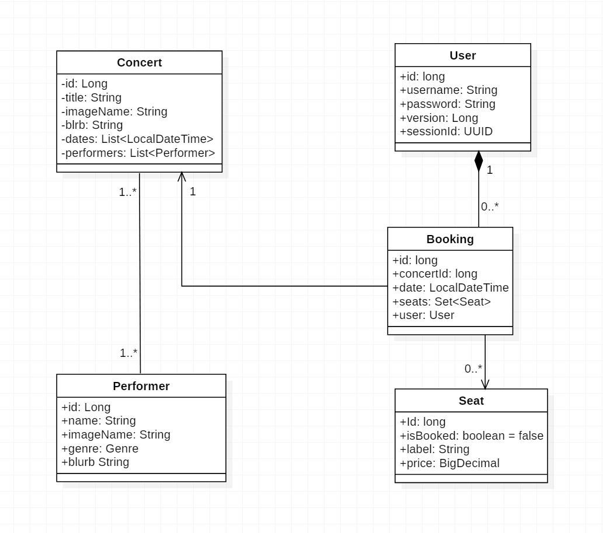
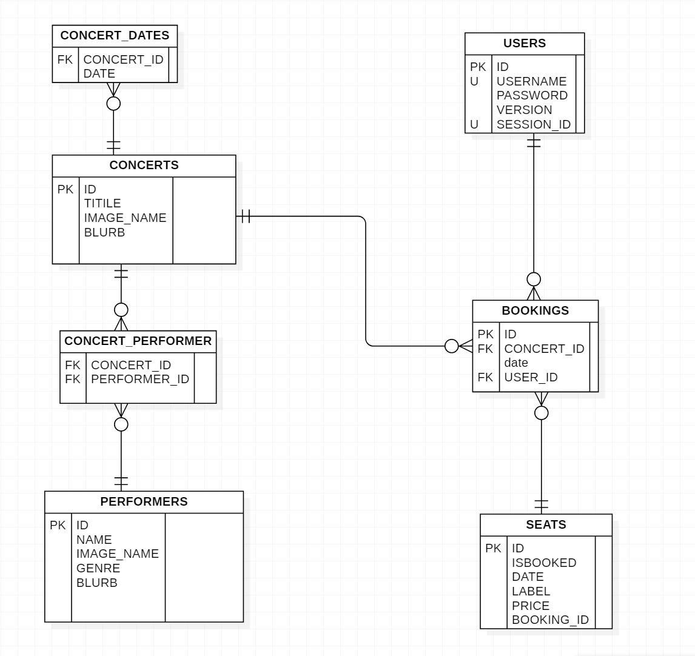
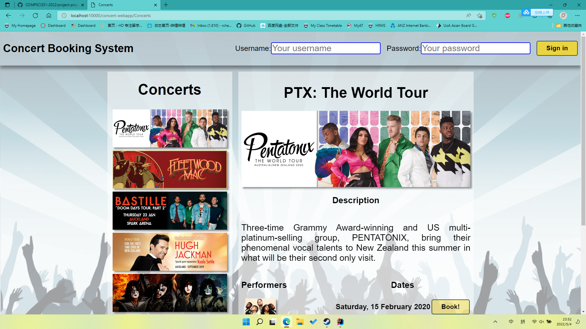

Team
=

- Callum Law (Calme1709)
- Ran Chen (ranc151)
- Zixun Wang (zwan669)

@zwan669:\
Do domain model annotations\
POST login\
GET concerts/{id}
GET concerts\
Code review

@Calme1709\
POST /bookings\
POST /subscribe/concertInfo\
GET /bookings/{id}\
Code review

@Ranc151\
GET concerts/summaries\
GET performers/\
GET performers/{id}\
GET bookings/\
GET seats/{time}?status\
Write Organisation.md

Domain model:\
Many performers can perform in many concerts.  A User can have many bookings, and each booking corresponds to only one concert. A booking can book many seats.

About concurrency errors:\
We used PESSIMISTIC_WRITE in case of double booking while booking seats. We use OPTIMISTIC_FORCE_INCREMENT in /login so that, the server won't generate two different cookies for a user.

client webapp runs well

Most of our communication was completed through discord, although we also used GitHub Team Discussions.
